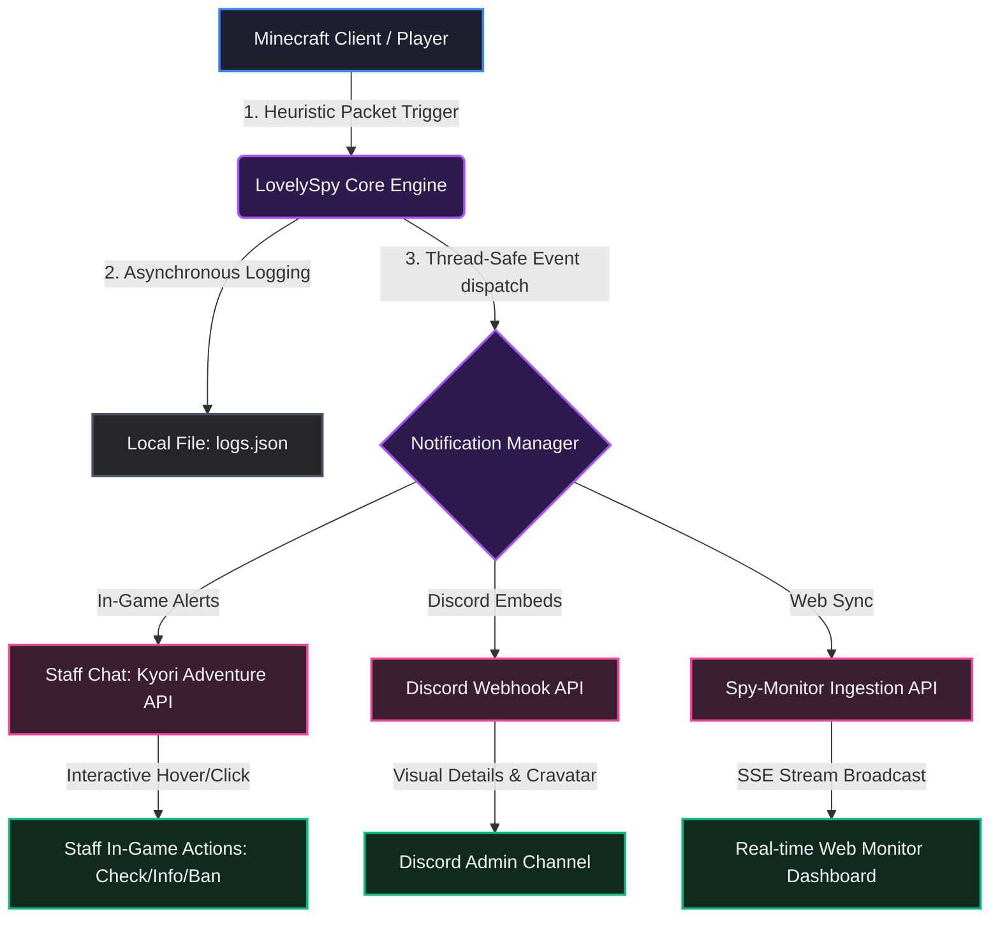
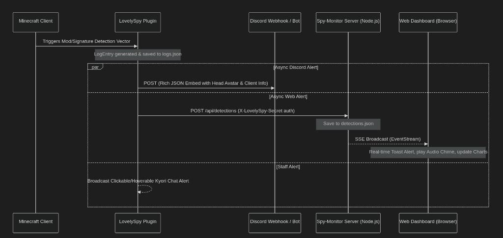

# LovelySpy 🕵️‍♂️

**LovelySpy** is an advanced, lightweight, and modern client/mod detection engine built for **Purpur 1.21.11** (supporting Folia). It utilizes multiple non-invasive detection vectors—including translation fingerprinting, client brand analysis, and plugin channel queries—to identify disallowed modifications and hacked clients without causing false positives.

It comes integrated with the native **PaperMC Dialog API** for real-time in-game configuration, a multi-channel alerting ecosystem (Discord, In-game, and Web), and an escalating punishment system.

---

## 🚀 Key Features

*   **Multi-Vector Detection Engine**:
    *   **Vector 1 (Translation Fingerprinting)**: Probes client translation support sequentially, confirms candidate results, and groups matching keys into one mod-level detection. `min_matches` can require multiple signatures before an action.
    *   **Vector 2 (Brand & Channel Analysis)**: Detects client identifiers sent during handshakes and queries listening plugin channels.
    *   **Vector 3 (Privacy Mod Detection)**: Detects chat signing bypasses (like NoChatReports), resource-pack spoofing, and confirmed key-resolution shielding used by OpSec/ExploitPreventer-style anti-fingerprinting tools.
    *   **Vector 4 (Resource Pack Alt Detection)**: Spots client resource pack status mismatches.
    *   **Vector 5 (Baritone Behavior Correlation)**: Requires repeated pathing/mining automation evidence and independent GrimAC flags inside one time window. It does not claim that a dormant Baritone installation can be fingerprinted.
    *   **Vector 6 (Timing Anomaly Detection)**: Uses sliding window statistical analysis to detect packet filtering anomalies caused by OpSec's selective blocking mechanisms. Implements z-score thresholding and exponential moving averages for real-time anomaly detection.
    *   **Vector 7 (Behavioral Consistency Detection)**: Uses graph-based correlation analysis to detect inconsistent behavior patterns across multiple detection vectors. Constructs behavior graphs and computes consistency scores using clustering coefficients and entropy analysis.
    *   **Vector 8 (Advanced Resource Pack Detection)**: Uses time series analysis and pattern recognition to detect OpSec's cache isolation and resource pack spoofing mechanisms. Implements statistical process control and machine learning-style pattern matching.
    *   **Vector 9 (Behavioral Paradox Engine)**: Advanced OpSec detection using behavioral paradox analysis. Accumulates "impossible" behavior combinations (fast sign response + vanilla brand, unsigned chat + premium account, etc.) using Bloom filters, weighted DAG graphs, and Z-score latency analysis. Detects OpSec's mixin-level bypasses that traditional methods miss.
    *   **Detection Correlation Engine**: Multi-vector Bayesian correlation system that combines evidence from all detection vectors using Bayes' theorem and belief propagation. Computes final confidence scores through ensemble methods with temporal decay and correlation boosting.
*   **Folia-Compatible Scheduling**: Thread-safe task execution using a custom scheduler utility supporting region-based multi-threading.
*   **In-Game Admin GUI (PaperMC Dialog API)**: Configure core delays, manage blacklisted/whitelisted brand lists, add new custom translation key detections, and choose response actions—all in-game.
*   **Escalating Ban System**: Auto-escalates ban durations for repeat offenses:
    1.  **1st Offense**: 15 Minutes
    2.  **2nd Offense**: 30 Minutes
    3.  **3rd Offense**: 1 Day
    4.  **4th Offense**: 3 Days
    5.  **5th+ Offense**: 30 Days
*   **JSON-based Logging**: Records all detections with granular metadata (UUID, Name, confidence levels, triggers, actions taken) in a clean `logs.json` file.

---

## 🏗️ System Architecture & Data Flow

LovelySpy implements a modular, asynchronous notification architecture designed to inform administrators instantly across three different channels (in-game chat, Discord, and the web-based Spy-Monitor panel) without blocking the server's main tick thread.

### 1. Functional Architecture Flowchart
This flowchart shows how client telemetry flows from the player to local storage and notification endpoints:



### 2. Temporal Event Lifecycle (Sequence Diagram)
This timeline represents the precise ordering of operations when a detection vector is triggered:




### 3. Detailed Operational Phases

#### Phase A: Ingestion & Telemetry Processing
When a player joins, Netty network handlers intercept client handshakes, brand declarations, and channel registrations. If any abnormal signatures (such as specific mod translation keys or chat-signing omissions) are recorded, the data is pushed to the evaluation queue.

#### Phase B: Evaluation & Classification
*   **Confidence Scaling**: Incoming flags are categorized into confidence classes (`CRITICAL`, `HIGH`, `MEDIUM`, `LOW`, `INCONCLUSIVE`).
*   **Offense Accumulation**: Triggered vectors check against the player's active profile in the `OffenseManager` to determine if escalation (such as kick or ban) is required based on historical offenses.

#### Phase C: Asynchronous Dispatch & Broadcasting
*   **Kyori Staff Alerting**: online administrators receive a chat message formatted with clickable links (`[INFO]`, `[CHECK]`, `[BAN]`) and hovering tooltips displaying full environment details.
*   **Discord Webhooking**: Sends a payload containing a structured embed card with color indicators matching the severity level and avatar imagery from Cravatar.
*   **Web API Synchronization**: A background request is fired to the Node.js server. The server stores the entry and pipes it through a Server-Sent Events (SSE) stream, instantly updating the browser dashboard, drawing analytics, and displaying desktop toast notifications.

---

## 🛠️ Commands & Permissions

All administrative commands require permission. Below is the command index:

| Command | Description | Permission | Default |
| :--- | :--- | :--- | :--- |
| `/lovelyspy gui` / `config` / `dialog` | Opens the interactive Dialog Configuration Menu | `lovelyspy.admin` | Op |
| `/lovelyspy check <player>` | Manually runs a translation probe on a player | `lovelyspy.check` | Op |
| `/lovelyspy info <player>` | Inspects client brand name and listening channels | `lovelyspy.check` | Op |
| `/lovelyspy list` | Lists online players with detected clients, loaders, and mods | `lovelyspy.check` | Op |
| `/lovelyspy offenses <player>` | Checks the current offense count for a player | `lovelyspy.check` | Op |
| `/lovelyspy resetoffense <player>` | Clears the recorded offenses back to 0 | `lovelyspy.reset` | Op |
| `/lovelyspy history <player>` | Displays the recent check logs of a player | `lovelyspy.check` | Op |
| `/lovelyspy alerts` | Toggles live in-game admin alert messages | `lovelyspy.alerts` | Op |
| `/lovelyspy reload` | Reloads `config.yml`, `mods.yml`, and `offenses.json` | `lovelyspy.reload` | Op |

---

## 📦 Default Detections (`mods.yml`)

The plugin comes pre-configured with detection rules for popular client packages and unfair mods:

*   **Hacked Clients (BAN)**: Meteor Client, Wurst Client, LiquidBounce, Aristois, BleachHack, Coffee Client, Lumina, Vape.
*   **Unfair Advantage Mods (KICK/BAN)**: KillAura (Fabric), AutoClicker (Fabric), Auto Clicker (p1k0chu), XRay (Fabric), ChestESP, Freecam, AutoTotem, Inventory Profiles Next, AutoFish, AutoSwitch, AntiAFK.
*   **Unallowed Utilities (KICK)**: World Downloader, Item Scroller, Xaero's Minimap, JourneyMap.
*   **Bypasses (BAN)**: OpSec / ExploitPreventer-style bypass protection. LovelySpy first records a failed vanilla control-key translation, then requires a separate confirmation probe over `key.forward`, `key.jump`, and `key.attack`; plain no-response remains inconclusive.
*   **Advanced OpSec Detection (FLAG/BAN)**: Multi-vector detection system specifically designed to bypass OpSec's anti-fingerprinting:
    *   **Vector 6 (Timing Anomaly Detection)**: Identifies packet filtering patterns using statistical analysis
    *   **Vector 7 (Behavioral Consistency Detection)**: Detects inconsistencies across translation probes, resource packs, and movement
    *   **Vector 8 (Advanced Resource Pack Detection)**: Identifies cache isolation and pack manipulation patterns
    *   **Vector 9 (Behavioral Paradox Engine)**: Advanced paradox detection using Bloom filters, weighted DAG graphs, and Z-score analysis for OpSec's mixin-level bypasses
    *   **Correlation Engine**: Bayesian network combining all vectors for high-confidence OpSec detection
*   **Unverifiable modded client (disabled by default)**: An optional strict policy for servers that prohibit clients whose installed mods cannot be verified. It is intentionally labelled `INCONCLUSIVE` even if the configured policy action is `BAN`.
*   **Baritone-like automation (FLAG by default)**: Correlates exact repeated block targeting or deterministic movement windows with at least two relevant GrimAC flags. Change this to `BAN` only after validating thresholds against normal players on the target server.

Meteor Client uses confirmed current keybind/category translations from its own namespace. Existing installations that still contain the obsolete `meteor-client.gui.tabs.mods` key are migrated automatically when the mod catalogue loads. A confirmed mod produces one action and one offense regardless of how many of its keys matched.

On Minecraft 1.21.11, probe signs are built through Paper's typed virtual-sign API. This is required because modern block-entity data stores structured text components; placing JSON inside legacy NBT string tags makes the JSON itself visible and creates an invalid mass-positive scan.

Current OpSec and ExploitPreventer can deliberately return the same key-resolution result as a
clean Fabric client. LovelySpy therefore reports a clean-looking scan from a known modded
environment as `UNVERIFIABLE`, not “passed.” Enable `mods.unverifiable_modded_client` only if the
server policy accepts banning all such clients; it cannot name which shield is installed.

**Advanced OpSec Detection**: LovelySpy now includes Vectors 6-8 and the Correlation Engine specifically designed to detect OpSec even when it's actively bypassing traditional detection methods:

1. **Vector 6 (Timing Anomaly Detection)**: OpSec's selective packet filtering creates timing anomalies that can be detected using sliding window statistical analysis with z-score thresholding and exponential moving averages.

2. **Vector 7 (Behavioral Consistency Detection)**: OpSec creates behavioral inconsistencies across different detection vectors (translation probes, resource packs, movement). Graph-based correlation analysis identifies these patterns using clustering coefficients and entropy analysis.

3. **Vector 8 (Advanced Resource Pack Detection)**: OpSec's cache isolation and resource pack manipulation create detectable patterns in time series data. Statistical process control identifies anomalies in pack loading behavior.

4. **Correlation Engine**: Bayesian network combines evidence from all vectors using Bayes' theorem with temporal decay and correlation boosting, providing high-confidence OpSec detection even when individual vectors are bypassed.

These advanced methods use sophisticated data structures (sliding windows, behavior graphs, time series) and algorithms (statistical anomaly detection, graph clustering, Bayesian inference) to detect OpSec's anti-fingerprinting mechanisms.

Standalone Baritone 1.21.11 exposes no stable translation key, custom brand, or plugin channel.
Vector 5 observes use rather than installation and connects to GrimAC reflectively when GrimAC is
present. Its thresholds are configured under `baritone-behavior` in `config.yml`.

---

## 🖥️ Web Panel Sync Configuration (`Spy-Monitor`)

To synchronize Minecraft anti-cheat flags with the web dashboard, you must establish a secure connection between the two systems.

### 🔑 Security Key Setup (Authentication)
Yes, you **must configure a shared authentication key** in both configuration files to allow the plugin to write detections to the web panel:

1.  **On the Minecraft Server**:
    In `/plugins/LovelySpy/config.yml`, find the `web-panel` section:
    ```yaml
    web-panel:
      enabled: true
      url: "http://<YOUR_WEB_PANEL_IP>:3000/api/detections"
      secret: "YOUR_CUSTOM_SECRET_KEY"  # <-- Change this from CHANGE_ME
    ```
2.  **On the Web Monitor Server**:
    In `Spy-Monitor/config.json`, configure the matching token:
    ```json
    {
      "port": 3000,
      "secret": "YOUR_CUSTOM_SECRET_KEY"  # <-- Must match config.yml
    }
    ```
*(Note: If the dashboard `secret` is left as `"CHANGE_ME"`, incoming requests will bypass secret verification, which is highly discouraged for public-facing deployments).*

### Starting the Web Dashboard
1. Navigate to the `Spy-Monitor/` directory.
2. Install dependencies:
   ```bash
   npm install
   ```
3. Start the dashboard:
   ```bash
   npm run start
   ```
4. Access the premium web UI in your browser at `http://localhost:3000`.

---

## 🔧 Building & Installation

### Requirements
*   **Java 25**
*   **Gradle 9.5+** or the included wrapper
*   **Purpur 1.21.11-R0.1-SNAPSHOT**

### Build the Plugin
To compile the plugin and generate the production `.jar` file, run:
```bash
./gradlew build
```
The output file will be saved at:
`build/libs/LovelySpy.jar`

### Install
1. Copy `LovelySpy.jar` to your Minecraft server's `plugins/` directory.
2. Restart the server.
3. Configure global settings in `plugins/LovelySpy/config.yml` and mod detections in `plugins/LovelySpy/mods.yml`, or use `/lovelyspy gui` in-game.
